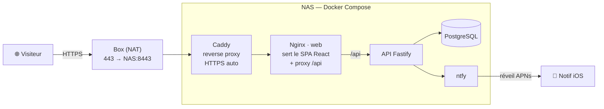

# Portfolio — Alexis Wallez

[](https://alexiswallez.fr)
[](https://react.dev)
[](https://www.typescriptlang.org)
[](https://docs.docker.com/compose/)
[](https://github.com/AWallez/portfolio/actions/workflows/ci.yml)

Portfolio full-stack de **développeur web freelance (React & DevOps)**, conçu, conteneurisé et **auto-hébergé** de bout en bout sur mon NAS. Le site est aussi une démo technique : le code de ce dépôt est ce qui tourne réellement en production sur **[alexiswallez.fr](https://alexiswallez.fr)**.

> Site vitrine React + TypeScript · API Node/Fastify + PostgreSQL pour le formulaire de contact · le tout conteneurisé (Docker) derrière un reverse proxy Caddy avec HTTPS automatique (Let's Encrypt).

## ✨ Points clés

- **Lighthouse (prod, mobile)** : 🟢 **100** SEO · **100** accessibilité · **100** bonnes pratiques · **~98** performance
- **Full-stack + infra** : front React, API Fastify, PostgreSQL, notifications push (ntfy), reverse proxy Caddy — orchestrés en **Docker Compose**
- **Bilingue FR/EN** et **thème clair/sombre**, esthétique terminal
- **Accessibilité (WCAG AA)** vérifiée, tests automatisés (Vitest + axe) et **CI GitHub Actions**
- **Auto-hébergé** sur NAS domestique (Linux, Docker), HTTPS via Let's Encrypt

## 🏗️ Architecture



Le front et l'API sont servis **depuis la même origine** (Nginx proxy `/api` → conteneur `api`) → aucun CORS côté navigateur. Seul Caddy est exposé publiquement ; Postgres et l'API ne sont joignables que par le réseau Docker interne.

## 🧱 Stack

| Couche | Technologies |
| --- | --- |
| **Front** | React 19 · TypeScript · Vite 8 · Tailwind CSS v4 · i18n FR/EN |
| **Back** | Node.js · Fastify 5 · PostgreSQL (`pg`) · ntfy |
| **Infra** | Docker / Docker Compose · Nginx · Caddy (HTTPS Let's Encrypt) · NAS Linux |
| **Qualité** | Vitest + Testing Library + axe · ESLint · GitHub Actions (lint / typecheck / build / test) |

## 📁 Structure du dépôt

```
portfolio/
├── frontend/   SPA React + TypeScript (Vite, Tailwind)   → voir frontend/README.md
├── backend/    API de contact Fastify + PostgreSQL       → voir backend/README.md
├── infra/      Docker Compose, Caddy, déploiement NAS     → voir infra/README.md
└── .github/    CI (lint · typecheck · build · test)
```

## 🚀 Démarrage rapide (dev local)

**Front** (sur `http://localhost:5173`) :

```bash
cd frontend
npm install
npm run dev
```

**API** (sur `http://localhost:3001`, nécessite un PostgreSQL + un topic ntfy) :

```bash
cd backend
npm install
cp .env.example .env    # remplir : Postgres + topic ntfy
npm run migrate         # crée la table 'contacts'
npm run dev
```

Détails dans [`frontend/README.md`](frontend/README.md) et [`backend/README.md`](backend/README.md).

## 📦 Déploiement

Toute la stack se déploie via **Docker Compose** depuis `infra/`. Voir **[`infra/README.md`](infra/README.md)** pour la procédure complète (variables d'environnement, HTTPS, notifications, spécificités NAS).

## 🧪 Qualité & CI

À chaque push/PR sur `main`, la CI GitHub Actions exécute sur le front : **lint** (ESLint), **typecheck** (`tsc`), **build** (Vite) et **tests** (Vitest, dont un smoke test d'accessibilité axe).

---

*Développé par [Alexis Wallez](https://alexiswallez.fr) — développeur web freelance full-stack & DevOps.*
